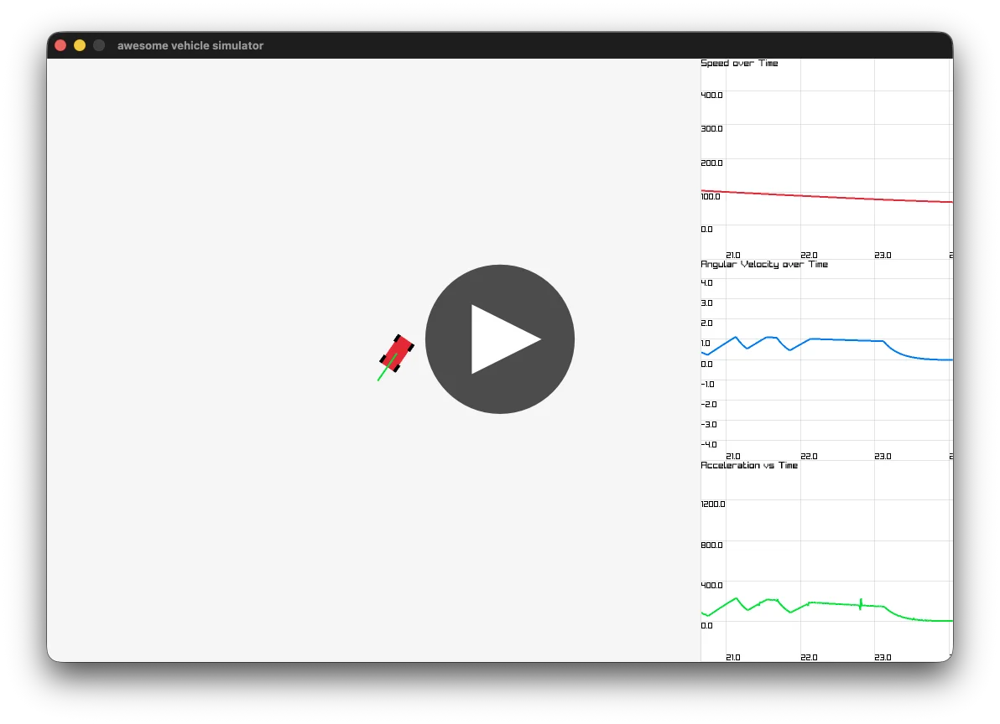

# Vehicle Sim Adventure

created by Thomas Shaw and Anthony Ge

## Demo video

Check out our demo video for a quick overview of the project!

[](https://www.youtube.com/watch?v=CnXWVtKBUeI)

## Usage

Run:

```
uv run main.py
```

## Development

Install requirements first:

- [uv](https://docs.astral.sh/uv/) for package management

To start the app with hot-reloading, run:

```sh
uv run jurigged -v main.py
```

Notably, this will only update methods on their **next** call, e.g. if a method includes a long-running loop and continually executes, it won't be reloaded even if updated on-disk.

### Code quality tools

We use basedpyright for type checking, included in dev dependencies and configured in `pyproject.toml`. Ideally, run the LSP and your editor should pick up the config.
